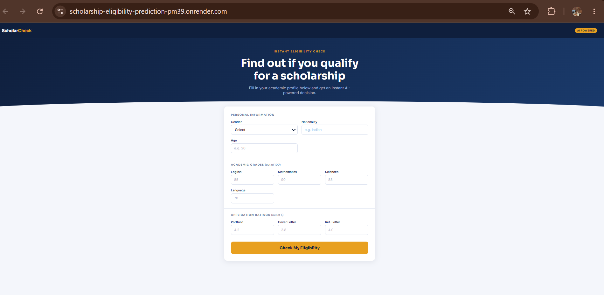

# 🎓 ScholarCheck — AI-Powered Scholarship Eligibility Predictor


An end-to-end machine learning web application that predicts whether a student is eligible for a scholarship based on their academic profile, grades, and application ratings — with an instant AI-powered decision.

> **Try it live →** [scholarship-eligibility-prediction-pm39.onrender.com](https://scholarship-eligibility-prediction-pm39.onrender.com/)

---

## 📸 Demo



Fill in your academic profile — gender, nationality, age, subject grades (out of 100), and application ratings (portfolio, cover letter, reference letter out of 5) — and get an instant eligibility decision.

---

## 🚀 Features

- **Instant Eligibility Prediction** — real-time ML inference on user-submitted academic data
- **Clean Web UI** — intuitive form built with Flask + HTML/CSS
- **Modular ML Pipeline** — separate components for data ingestion, transformation, and model training
- **Multi-Model Training** — trains 6 classifiers with hyperparameter tuning and selects the best
- **DVC Integration** — reproducible data and model versioning
- **Production-Ready Structure** — custom exception handling, structured logging, and utility modules
- **Deployed on Render** — publicly accessible at all times

---

## 🧠 Input Features

| Category | Feature | Range |
|---|---|---|
| Personal | Gender | Male / Female / Other |
| Personal | Nationality | Categorical |
| Personal | Age | Numeric |
| Academic Grades | English, Mathematics, Sciences, Language | 0 – 100 |
| Application Ratings | Portfolio, Cover Letter, Reference Letter | 0 – 5 |

---

## 🏗️ Project Architecture

```
scholarship-eligibility-prediction/
│
├── src/mlproject/
│   ├── Components/
│   │   ├── data_ingestion.py
│   │   ├── data_transformation.py
│   │   └── model_trainer.py
│   ├── pipelines/
│   │   ├── training_pipeline.py
│   │   └── prediction_pipeline.py
│   ├── exception.py
│   ├── logger.py
│   └── utils.py
│
├── templates/
│   └── index.html
├── artifacts/
├── app.py
└── train.py
```

---

## ⚙️ Tech Stack

| Layer | Technology |
|---|---|
| ML Models | Logistic Regression, Decision Tree, Random Forest, XGBoost, CatBoost, KNN |
| Web Framework | Flask |
| Experiment Tracking | MLflow + DagsHub |
| Data Versioning | DVC |
| Language | Python 3.8+ |
| Deployment | Render |

---

## 🛠️ Getting Started

### 1. Clone the repository

```bash
git clone https://github.com/chaitanyarast23/End-to-End-Scholarship_Eligibility_Prediction.git
cd scholarship-eligibility-prediction
```

### 2. Create a virtual environment

```bash
python -m venv myenv     
myenv\Scripts\activate         
```

### 3. Install dependencies

```bash
pip install -r requirements.txt
```

### 4. Train the model

```bash
python train.py
```

This runs the full pipeline: data ingestion → transformation → model training. Artifacts are saved to the `artifacts/` directory.

### 5. Run the web app

```bash
python app.py
```

Visit `http://localhost:5000` in your browser.

---

## 📊 Models

Six classifiers are trained and compared with **hyperparameter tuning**. The best-performing model is selected automatically.

| Model | Library |
|---|---|
| Logistic Regression | scikit-learn |
| Decision Tree | scikit-learn |
| Random Forest | scikit-learn |
| XGBoost | xgboost |
| CatBoost | catboost |
| K-Nearest Neighbors | scikit-learn |

All runs are tracked on MLflow via DagsHub. The best model is saved to `artifacts/` and served via the prediction pipeline.

---

## 🗂️ Data Tracking (DVC)

This project uses [DVC](https://dvc.org/) for data versioning only.

```bash
dvc pull   # Pull tracked data
```

---

## 📈 Experiment Tracking (MLflow + DagsHub)

All model experiments, hyperparameter runs, and metrics are tracked via **MLflow** and logged remotely on **[DagsHub](https://dagshub.com/)**.

Each training run logs:
- Model name and hyperparameters
- Accuracy, F1 score, and other classification metrics
- Best model artifact

---

## 📁 Key Files

| File | Purpose |
|---|---|
| `app.py` | Flask app — routes and request handling |
| `train.py` | Entry point to trigger model training |
| `templates/index.html` | Front-end form for user input |
| `src/mlproject/Components/` | Core ML components |
| `src/mlproject/pipelines/` | Training and prediction pipelines |
| `src/mlproject/exception.py` | Custom exception class |
| `src/mlproject/logger.py` | Logging configuration |

---

## 🌐 Deployment

The app is deployed on **Render** (free tier). To deploy your own instance:

1. Push the repository to GitHub
2. Connect the repo to [Render](https://render.com/)
3. Set the start command to:
   ```
   python app.py
   ```
4. Render auto-detects Python and installs from `requirements.txt`

---

## 🤝 Contributing

Pull requests are welcome. For major changes, please open an issue first to discuss what you'd like to change.

---

